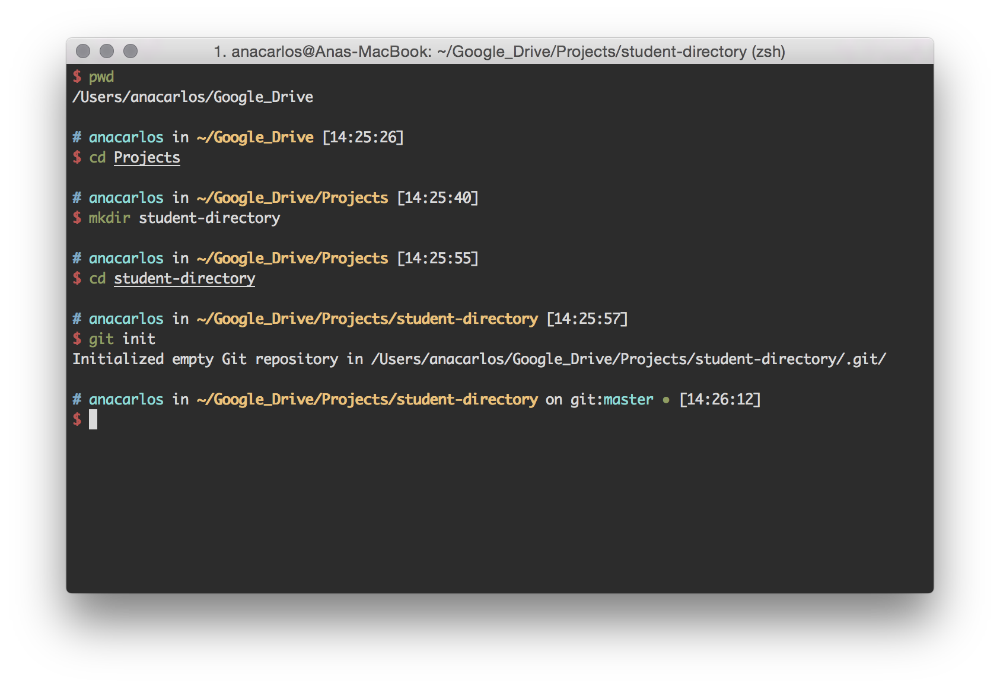
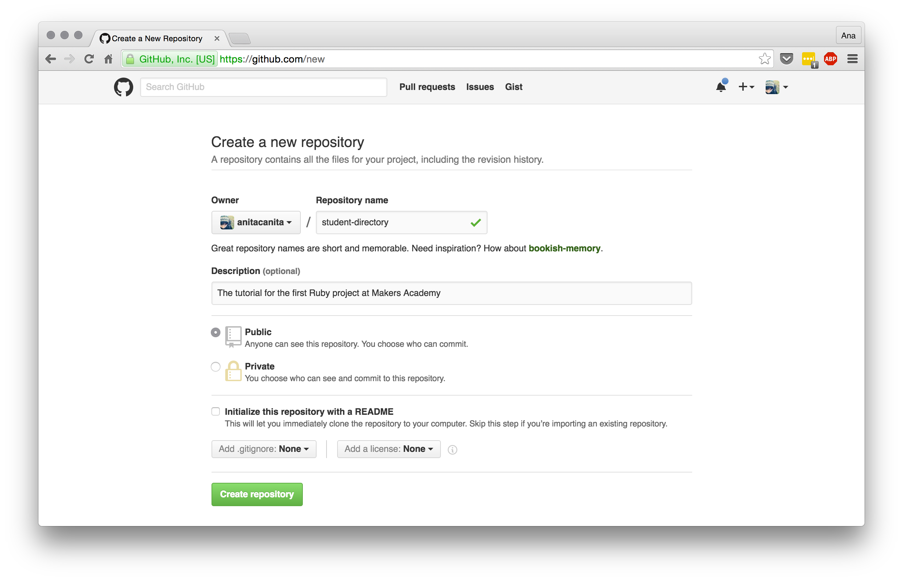
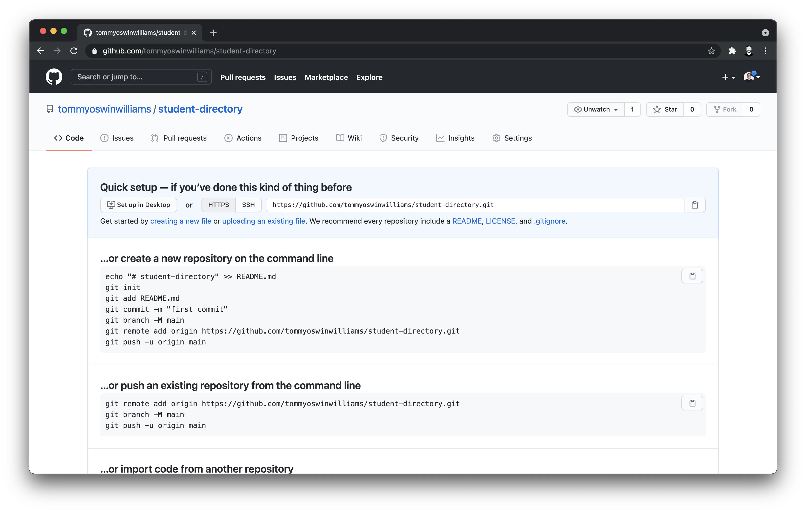
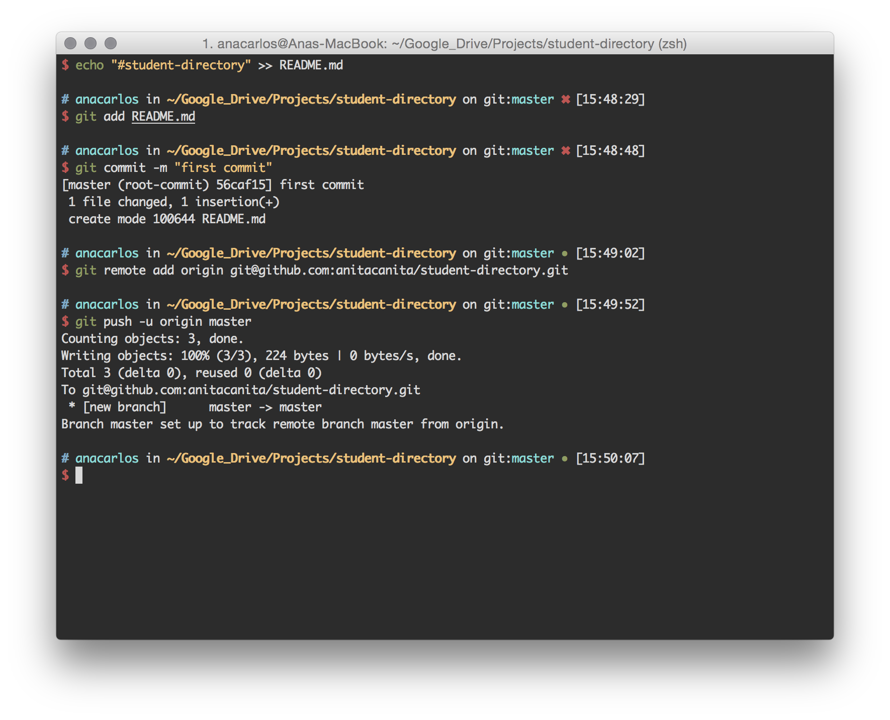
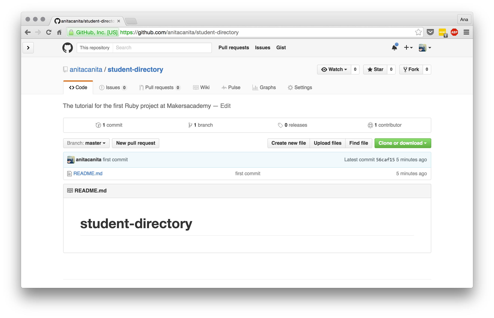
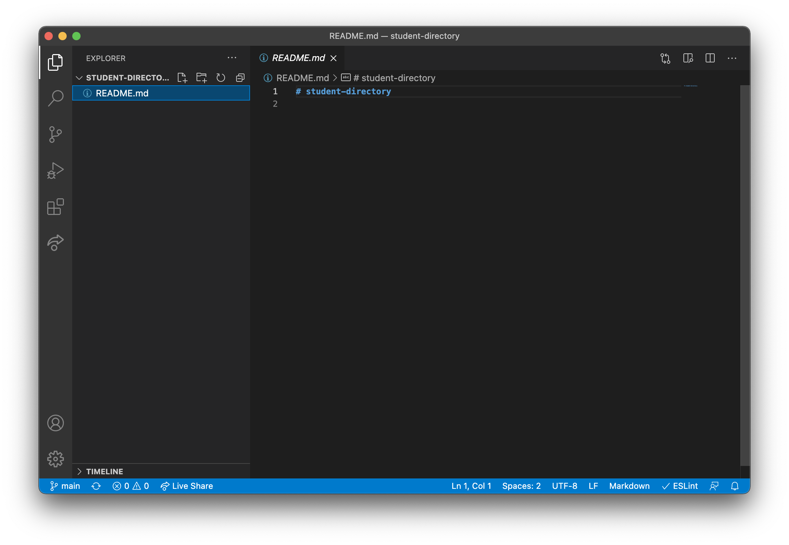
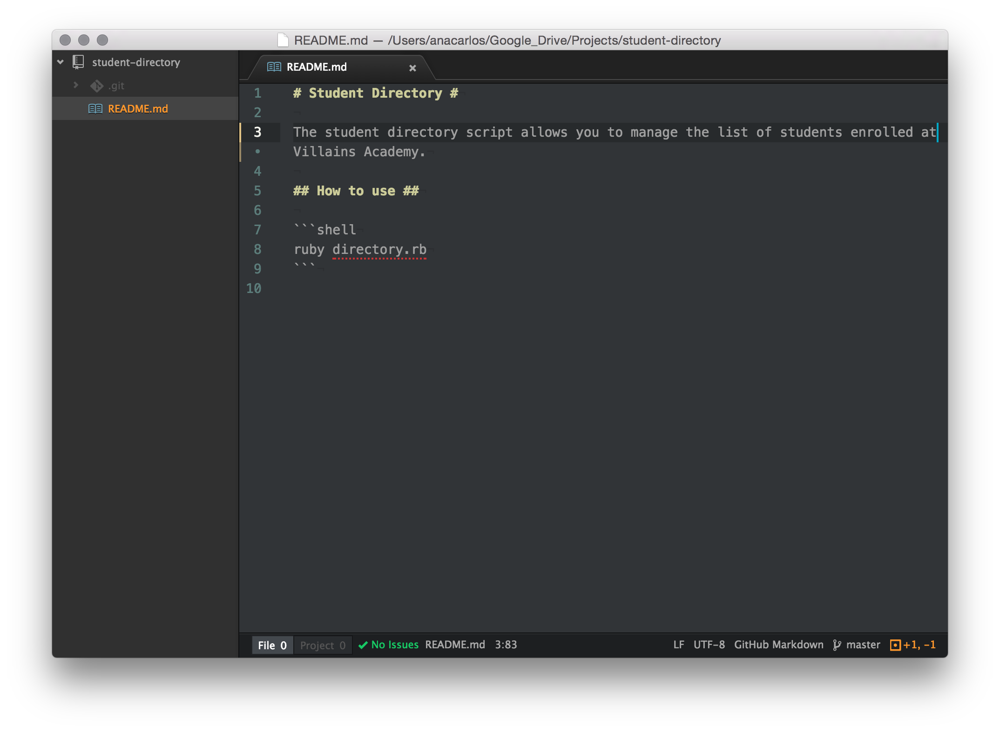
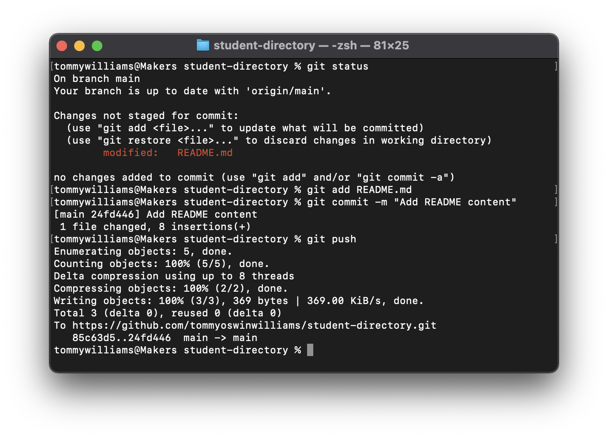
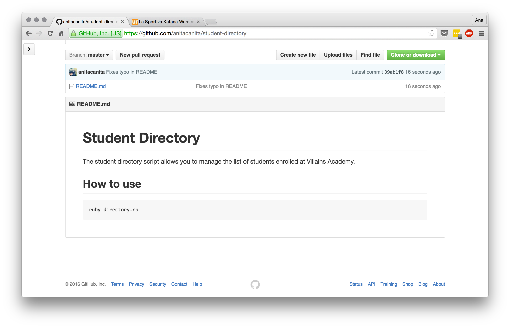

# 1. Setting up your environment

[Back to README](README.md)

First, open the terminal and navigate to your project directory. Then create a new directory called `student-directory` (:pill: [The command line](https://makersacademy.teachable.com/courses/256825/lectures/3989176)), change into it and initialise it as an empty git repository (:pill: [Version Control with Git](https://makersacademy.teachable.com/courses/256825/lectures/3989156)).



It makes sense to keep all projects you'll be working on in a designated project directory (and not on desktop, for example).

We always begin a new project (unless it's a throwaway code that will not live until tomorrow) by initialising a new repository.

**Now let's create a repository on GitHub!**



Make it public, name it "student-directory" (it's usually a good idea to use the same name for Github repos and local folders) but don't initialise it with a README – we'll do it manually.



Let's now add a README file and create a local remote ( :pill: [Version Control with Git](https://makersacademy.teachable.com/courses/256825/lectures/3989156)). Github gives you steps required to do it:

````
echo "# student-directory" >> README.md
git init
git add README.md
git commit -m "first commit"
git remote add origin git@github.com:REPLACE-WITH-YOUR-GITHUB-USERNAME/student-directory.git
git push -u origin master
````

**Don't copy-paste them, though. Type everything in, it's really important to remember everything. If you copy-paste code, you may as well skip the exercise altogether.**

Typing everything in also forces you to think about what exactly is going on. For example, what will `echo "# student-directory" >> README.md` do? And
what about the `git init` command? Is it really necessary here, given that we've already initialised the repo? Maybe not.



Once you do it, refresh the Github page. It should show an empty repo (with the README.md file only).



Good, now we have an empty repo with a remote called "master" pointing to Github. This is the basic groundwork you need to do before creating any new project.

Note how Github displays the contents of the `README.md` file on your project page (can you figure out where does the "student-directory" text come from?). This is because the file is named README, it's the default name for the file that has information about the project. The "md" extension means that the format of this file is [markdown](http://daringfireball.net/projects/markdown/syntax). We'll write some [markdown](http://daringfireball.net/projects/markdown/syntax) soon.

Let's start Visual Studio Code now. You should be able to do this by running `code .` in the project directory (note there's a space between `code` and the dot). The dot stands for the current directory and `code` is the symlink to open VS Code. If you don't have it (_that is, if you get an error message when trying to run the command_), you probably don't have this shortcut set up (:pill: [VS Code](https://makersacademy.teachable.com/courses/256825/lectures/30628198)).

After you launch VS Code, it should look like this.



If you don't see the list of files and folders on the left, go to `File` → `Add Folder to Workspace...` and select your `student-directory` folder.

Right now, the only thing on our README is the name of the repo. Let's write a proper description for the project. This is a good idea because it will let other developers to quickly see what the codebase does. Every good project on GitHub has a good `README` file.

Below is the README we wrote for the project. It was written using [Github-flavoured markdown](https://help.github.com/articles/about-writing-and-formatting-on-github/). Take a look the both the [markdown reference](http://daringfireball.net/projects/markdown/syntax) and the [Writing on Github](https://help.github.com/categories/writing-on-github/) reference so that you know what's possible.



 Go ahead and write your own README (you can just copy the one we did). When you're done, commit the changes and push to Github to see what it looks like there.



If you get the **"push.default is unset"** warning, like in the screenshot above, just choose the `simple` mode as the default.

````
git config --global push.default simple
````

There's an [explanation on StackOverflow](http://stackoverflow.com/questions/11872984/what-is-the-difference-between-git-push-default-current-and-push-default-upstrea) of what this warning means. Don't worry if it sounds a bit cryptic right now.

After we push the README file, we'll see it on Github.



Now we have a local and and a remote repo with a README file that describes the project we're about to create.

[Next: Printing the list of students](02_printing_list_students.md)
