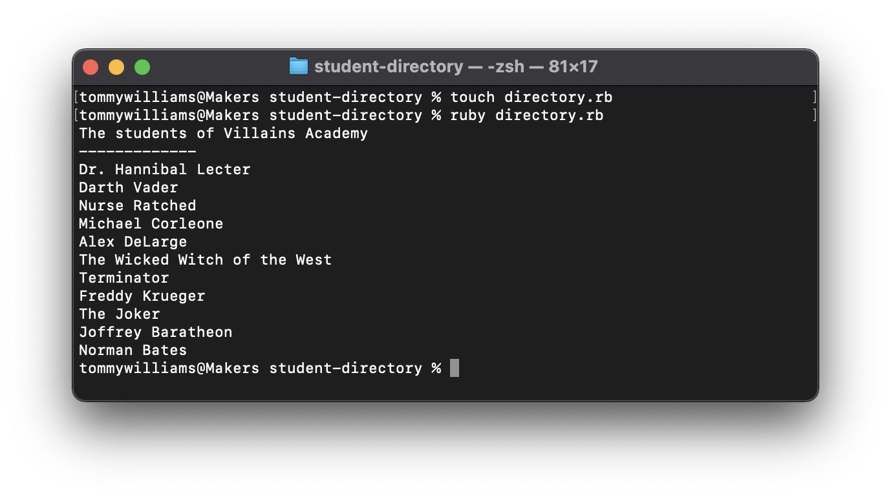

## Printing the list of students

Let's now write some Ruby code. First, create a file called directory.rb in the project directory by using the "touch" command (:pill: [The command line](https://github.com/makersacademy/pre_course/blob/master/pills/command_line.md)). Don't forget the extension (".rb") and don't put any spaces in the filename.

Now you should see the empty file in the text editor.

**Reminder: do not copy-paste the code! Always type everything yourself.**

````ruby
puts "The students of Villains Academy"
puts "-------------"
puts "Dr. Hannibal Lecter"
puts "Darth Vader"
puts "Nurse Ratched"
puts "Michael Corleone"
puts "Alex DeLarge"
puts "The Wicked Witch of the West"
puts "Terminator"
puts "Freddy Krueger"
puts "The Joker"
puts "Joffrey Baratheon"
puts "Norman Bates"
````

Now save the file and run it by passing the filename as an argument to ruby.



You should see all names printed on the screen.

Let's do two things now. Firstly, we need to commit the change. Secondly, we'll discuss what exactly this code does.

We need to commit the change because we've just done a small but meaningful piece of work. Every time you do finish a small task, you need to commit your code. What is a small task? There's no fast and easy rule but there are a few rules of thumb you can use.

It's a good idea to commit code once a specific change was introduced to the codebase and this change is finished. For example, we've just put a list of students in the codebase. We are happy with the codebase as it is right now because it works. A bad time to commit the code would be when the code is broken (it throws an error) or half-finished (you haven't double-checked the spelling yet, for example).


Now, what does the code do? Every puts statement prints a line of text in the terminal. More precisely, it prints it to the standard output (:pill: [Command line](https://github.com/makersacademy/pre_course/blob/master/pills/command_line.md)).

`puts` itself is a method provided by Ruby. The string after every `puts` is an argument. In Ruby we can use parentheses around arguments but it's not mandatory (:pill: [Methods](https://github.com/makersacademy/pre_course/blob/master/pills/methods.md)). So, another way of writing the same code would be

````ruby
puts("The students of Villains Academy")
puts("-------------")
puts("Dr. Hannibal Lecter")
puts("Darth Vader")
puts("Nurse Ratched")
puts("Michael Corleone")
puts("Alex DeLarge")
puts("The Wicked Witch of the West")
puts("Terminator")
puts("Freddy Krueger")
puts("The Joker")
puts("Joffrey Baratheon")
puts("Norman Bates")
````

The method "puts" adds a line return after printing each argument. It's invisible but it causes the "cursor" to wrap onto the next line. That's why every name is printed on a new line. What if we didn't want the line to be wrapped automatically? Ruby provides a method "print" that's just like "puts" except it doesn't wrap the line. Add this code to the end of your Ruby file:

````ruby
print "Overall, we have "
print 11
puts " great students"
````

Note how the lines don't wrap if we use "print".

````
ruby directory.rb
The students of my cohort at Makers Academy
-------------
Dr. Hannibal Lecter
Darth Vader
Nurse Ratched
Michael Corleone
Alex DeLarge
The Wicked Witch of the West
Terminator
Freddy Krueger
The Joker
Joffrey Baratheon
Norman Bates
Overall, we have 11 great students
````

If you want to put the line break character manually, you can do it like this:

````
print "line1\nline2\nline3" # has to be in double quotes!
````

The "\n" is an escape sequence (*[There are many more of them](http://en.wikibooks.org/wiki/Ruby_Programming/Strings#Escape_sequences)*).

So, now that we added the student count, let's commit it again (don't forget to add a meaningful commit message).

We could now add some comments to our Ruby code as well.

````ruby
#first we print the list of students
puts "The students of Villains Academy"
puts "-------------"
puts "Dr. Hannibal Lecter"
puts "Darth Vader"
puts "Nurse Ratched"
puts "Michael Corleone"
puts "Alex DeLarge"
puts "The Wicked Witch of the West"
puts "Terminator"
puts "Freddy Krueger"
puts "The Joker"
puts "Joffrey Baratheon"
puts "Norman Bates"
#finally, we print the total
print "Overall, we have "
#it’s important that print() doesn’t add new line characters
print 11
puts " great students"
````

And let's commit the code again, just for practice.
