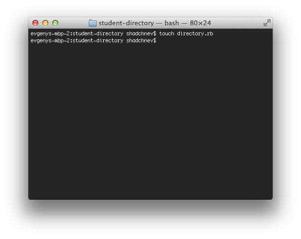

:construction: Under revision :construction:

<!-- ## Version 1: Printing the list of students

Let's now write some Ruby code. First, create a file called directory.rb in the project directory by using the "touch" command (:pill: [The command line](https://github.com/makersacademy/course/blob/master/pills/command_line.md)). Don't forget the extension (".rb") and don't put any spaces in the filename.



Now you should see the empty file in SublimeText.


Find out the names of the students in your cohort (great excuse to say hello to everyone again and have a little chat!) and print them all. I'll just use fictional names here.

**Reminder: do not copy-paste the code! Always type everything yourself.**

````ruby
puts "The students of Villains Academy"
puts "-------------"
puts "Dr. Hannibal Lecter"
puts "Darth Vader"
puts "Nurse Ratched"
puts "Michael Corleone"
puts "Alex DeLarge"
puts "The Alien"
puts "Terminator"
puts "Freddy Kruger"
puts "The Joker"
````

Now save the file and run it by passing the filename as an argument to ruby.


You should see all names printed on the screen. If you get an error, it may look like this.

````ruby
directory.rb:7: syntax error, unexpected tCONSTANT, expecting end-of-input
puts "Alex DeLarge"
          ^
````

Here, Ruby gives you the name of the file ("directory.rb"), the line where the error occurred (7), specifics of the problem ("syntax error, unexpected tCONSTANT, expecting end-of-input") and the line that causes the error (`puts "Alex DeLarge"`). Finally, it uses the caret (^) symbol to show where exactly the problem lies. In this case I caused this problem to happen by "accidentally" using an single quote instead of a double quote on the previous line. So Ruby assumed the string from the previous line continued until the first double quote on this line. After that Ruby decided that "Alex" is not part of the string (because it had just been closed), so it must be part of the program. However, we don't have a variable called Alex, so Ruby got confused and threw an error, letting us know that it has no idea what "Alex" is. All because I _accidentally_ used a single quote instead of a double quote.

Let's do two things now. Firstly, we need to commit the change. Secondly, we'll discuss what exactly this code does.

We need to commit the change because we've just done a small but meaningful piece of work. Every time you do finish a small task, you need to commit your code. What is a small task? There's no fast and easy rule but there are a few rules of thumb you can use.

It's a good idea to commit code once a specific change was introduced to the codebase and this change is finished. For example, we've just put a list of students in the codebase. We are happy with the codebase as it is right now because it works. A bad time to commit the code would be when the code is broken (it throws an error) or half-finished (you haven't double-checked the spelling yet, for example).


Now, what does the code do? Every puts statement prints a line of text in the terminal. More precisely, it prints it to the standard output (:pill: [The command line](https://github.com/makersacademy/course/blob/master/pills/command_line.md)).

`puts` itself is a method provided by Ruby. The string after every `puts` is an argument. In Ruby we can use parentheses around arguments but it's not mandatory (:pill: [methods](https://github.com/makersacademy/course/blob/master/pills/methods.md)). So, another way of writing the same code would be

````ruby
puts("The students of Villains Academy")
puts("-------------")
puts("Dr. Hannibal Lecter")
puts("Darth Vader")
puts("Nurse Ratched")
puts("Michael Corleone")
puts("Alex DeLarge")
puts("The Alien")
puts("Terminator")
puts("Freddy Kruger")
puts("The Joker")
````

The method "puts" adds a line return after printing each argument. It's invisible but it causes the "cursor" to wrap onto the next line. That's why every name is printed on a new line. What if we didn't want the line to be wrapped automatically? Ruby provides a method "print" that's just like "puts" except it doesn't wrap the line. Add this code to the end of your Ruby file:

````ruby
print "Overall, we have "
print 9
puts " great students"
````

Note how the lines don't wrap if we use "print".

````
ruby directory.rb
The students of my cohort at Makers Academy
-------------
Dr. Hannibal Lecter
Darth Vader
Nurse Ratched
Michael Corleone
Alex DeLarge
The Alien
Terminator
Freddy Kruger
The Joker
Overall, we have 9 great students
````

If you want to put the line break character manually, you can do it like this:

````
print "line1\nline2\nline3" # has to be in double quotes!
````

The "\n" is an escape sequence (_[There are many more of them](http://en.wikibooks.org/wiki/Ruby_Programming/Strings#Escape_sequences)_).

So, now that we added the student count, let's commit it again.


If you would like to see what the code looks like at this stage of the tutorial, [follow this link](https://github.com/makersacademy/student-directory/tree/eff34bdc6aa33810178b6dac18bbe7e917523fef).

Let's now add some comments to our Ruby code as well.

````ruby
#first we print the list of students
puts "The students of Villains Academy"
puts "-------------"
puts "Dr. Hannibal Lecter"
puts "Darth Vader"
puts "Nurse Ratched"
puts "Michael Corleone"
puts "Alex DeLarge"
puts "The Alien"
puts "Terminator"
puts "Freddy Kruger"
puts "The Joker"
#finally, we print the total
print "Overall, we have "
#it’s important that print() doesn’t add new line characters
print 9
puts " great students"
````

And let's commit the code again, just for practice (don't forget to add a meaningful commit message).

If you would like to see what the code looks like at this stage of the tutorial, [follow this link](https://github.com/makersacademy/student-directory/tree/44f6e11c888d45931e802bc5da082e97eeed2046). -->

<!-- ## Version 2: Refactoring (cleaning the code)

Refactoring is the process of improving the code without changing what it does. Let's make our code slightly better by introducing a variable instead of a number on line 16. Why? It's more descriptive. It may not matter much in such a simple example but in a more complex programs numbers numbers used on their own may be a source of confusion. There's a good discussion of these numbers (called magic numbers) and a few code examples in [Wikipedia](http://en.wikipedia.org/wiki/Magic_number_(programming)).

So, let's extract the number 9 into a variable. Define it at the beginning of the file

````ruby
student_count = 9
````

and print it instead of the raw number

````ruby
print student_count
````

Now your code looks like this.

````ruby
		student_count = 9
		# first, we print the list of students
		puts "The students of Villains Academy"
		puts "-------------"
		puts "Dr. Hannibal Lecter"
		puts "Darth Vader"
		puts "Nurse Ratched"
		puts "Michael Corleone"
		puts "Alex DeLarge"
		puts "The Alien"
		puts "Terminator"
		puts "Freddy Kruger"
		puts "The Joker"
		# finally, we print the total
		print "Overall, we have "
		# it's important that print() doesn't add new line characters
		print student_count
		puts " great students"
````

Now line 17 clearly communicates what it does. Let's reduce the line count by two by using interpolation (:pill: [String interpolation](https://github.com/makersacademy/course/blob/master/pills/string_interpolation.md) ). Replace the last three lines with this.

````ruby
 # finally, we print the total
puts "Overall, we have #{student_count} great students"
````

Now our code is both shorter and more expressive than it was before. Good time to commit it.

If you would like to see what the code looks like at this stage of the tutorial, [follow this link](https://github.com/makersacademy/student-directory/tree/d47b0fa16e4e0c62c7194a3cbb49274dd509c6fd).

## Version 3: Arrays

Our code works but it's not perfect. There are two problems here. Firstly, it's repetitive. The same operation – printing the student name – is repeated several times. Every time you see any kind of repetition in code, try to eliminate it because it will result in a hard to maintain code at best or be a source of nasty bugs at worst. For example, if we want to add one more student to our program, do we really have to type "puts" again? What if we had a thousand students? Oh, and we'll need to manually update `student_count`. That's a big red flag.

Secondly, the data (student names) is tightly coupled with what we do with this data (printing it). What if we wanted to change the way the students are printed, for example putting a number in front of the name? That'd mean updating every single line that prints a student name. What if we wanted to print the list twice: first in alphabetical order, then in reverse order? You can see how quickly it can all go wrong.

Arrays (:pill: [Arrays](https://github.com/makersacademy/course/blob/master/pills/arrays.md) ) will help us avoid both of these problems. Let's start by putting the students into an array. Remember, don't copy-paste, type everything in yourself, it's important. Make sure you understand every line here: _if you don't, talk to other students or the coaches_.

````ruby
		student_count = 9
		# let's put all students into an array
		students = [
		  "Dr. Hannibal Lecter",
		  "Darth Vader",
		  "Nurse Ratched",
		  "Michael Corleone",
		  "Alex DeLarge",
		  "The Alien",
		  "Terminator",
		  "Freddy Kruger",
		  "The Joker"
		]
		# and then print them
		puts "The students of Villains Academy"
		puts "-------------"
		puts students[0]
		puts students[1]
		puts students[2]
		puts students[3]
		puts students[4]
		puts students[5]
		puts students[6]
		puts students[7]
		puts students[8]
		# finally, we print the total
		puts "Overall, we have #{student_count} great students"
````

It still does exactly the same thing as before. However, if still suffers from the same problems that we discussed above. Why did we put the students into an array then? Because now we can actually improve our code.

Let's start with a student count. Now that our students are in an array, we can use the array's length() method to count them instead of doing it manually. Get rid of the `student_count` variable and update the last line:

````ruby
		puts "Overall, we have #{students.length} great students"
````

Now if we put one more student in the array, we won't have to update the `student_count` variable. That's really good news.

What about the repetition? There's a way to print every value in the array without referring to each value individually. We will discuss how it actually works later on but for now you can learn how to do it even if you don't understand everything that's going on behind the scenes.

Doing some operation on every value of an array is called iterating. One such operation is called an iteration. So if we need to print every value of an array, we need to iterate over this array and print the current value on every iteration. Makes sense? Let's see what the code would look like. Instead of `puts students[0]` ... `puts students[8]` you can do this:

````ruby
		students.each do |student|
		  puts student
		end
````

We'll discuss exactly how this works later, but for now just understand what it does. This code takes every name from the array `students` and for each name it executes the block of code between `do` and `end`. Every execution of this block of code is called an iteration. On every iteration, the current name will be assigned to the value `student` that we specified between two vertical bars.

So, on the very first iteration, it will take the first value from the array ("Dr. Hannibal Lecter") and assign it to the variable `student`. Then, it will execute the block of code (`puts student`) that will print it to the screen. Since "Dr. Hannibal Lecter" is not the last person in our array of charming students, Ruby will perform the second iteration, assigning the value of "Darth Vader" to the variable `student` and printing it again.

Now our program is much shorter.

````ruby
		# let's put all students into an array
		students = [
		  "Dr. Hannibal Lecter",
		  "Darth Vader",
		  "Nurse Ratched",
		  "Michael Corleone",
		  "Alex DeLarge",
		  "The Alien",
		  "Terminator",
		  "Freddy Kruger",
		  "The Joker"
		]
		# and then print them
		puts "The students of Villains Academy"
		puts "-------------"
		students.each do |student|
		  puts student
		end
		# finally, we print the total
		puts "Overall, we have #{students.length} great students"
````

By doing this we have solved two problems. Firstly, we separated the data (the array) from the operation on this array (line 17). This means that if we want to print this array again, it's very easy to do. It also means that if we want to add one more student, we won't have to do anything other than adding one more name to the array. On top of that, we could get rid of the `student_count` variable.

Secondly, we got rid of the repetition. This means that if we want to change the way this array is printed, there's only one line to update, line 17.

It's certainly a good time to commit the code.

If you would like to see what the code looks like at this stage of the tutorial, [follow this link](https://github.com/makersacademy/student-directory/tree/a08bb43b1ba0f4304ff6602daf8cdf92cec70020). -->

<!-- ## Version 4: Methods

Remember we discussed methods (:pill: [methods](https://github.com/makersacademy/course/blob/master/pills/methods.md) )? Let's create a few methods to make our program easier to read.

````ruby
#let's put all students into an array
students = [
  "Dr. Hannibal Lecter",
  "Darth Vader",
  "Nurse Ratched",
  "Michael Corleone",
  "Alex DeLarge",
  "The Alien",
  "Terminator",
  "Freddy Kruger",
  "The Joker"
]

def print_header
  puts "The students of Villains Academy"
  puts "-------------"
end

def print(names)
  names.each do |name|
    puts name
  end
end

def print_footer(names)
  puts "Overall, we have #{names.length} great students"
end
#nothing happens until we call the methods
print_header
print(students)
print_footer(students)
````

Let's start by discussing why we've done it in the first place and then talk about how it works.

Now that we have extracted the code into the methods, the body of our program reads almost like English. First, we print the header. Then we print the list of students. Finally, we print the footer. It's easy to see what's going on without looking at the implementation.

Note that we are now passing the students variable to the methods as an argument (called "names" in both cases). This is because the methods don't have access to local variables defined outside them, so we couldn't have references `students`. In any case, in most cases it's a good idea to pass the data the a method needs as an argument to make the code easier to understand.

Let's check the code in. Are you using good commit messages?

If you would like to see what the code looks like at this stage of the tutorial, [follow this link](https://github.com/makersacademy/student-directory/tree/d8a01783d4c57379cb95160456fc830d45a42b55). -->

<!-- ## Version 5: Adding more information about the student

Right now the only information we have about our students is the name. What if we want to know what cohort they belong to? Let's update our students array to be an array of arrays. The nested arrays will have both the name and the cohort month.

````ruby
students = [
  ["Dr. Hannibal Lecter", :november],
  ["Darth Vader", :november],
  ["Nurse Ratched", :november],
  ["Michael Corleone", :november],
  ["Alex DeLarge", :november],
  ["The Alien", :november],
  ["Terminator", :november],
  ["Freddy Kruger", :november],
  ["The Joker", :november]
]
````

Since we changed our data structure, let's also update the print() method. Note that I renamed the argument since we are not passing just a name anymore. Also, I'm storing the cohort month as a symbol because I don't expect to treat it as a string (that is, combine it with another string, manipulate individual characters, etc).

````ruby
def print(students)
  students.each do |student|
    puts "#{student[0]} (#{student[1]} cohort)"
  end
end
````

This gives us a beautiful output.

````
ruby directory.rb
The students of my cohort at Makers Academy
-------------
Dr. Hannibal Lecter (november cohort)
Darth Vader (november cohort)
Nurse Ratched (november cohort)
Michael Corleone (november cohort)
Alex DeLarge (november cohort)
The Alien (november cohort)
Terminator (november cohort)
Freddy Kruger (november cohort)
The Joker (november cohort)
Overall, we have 9 great students
````

However, what's the problem with this code? Stop here for a second. Before you read the answer, ask yourself, what's wrong with this line:

````ruby
puts "#{student[0]} (#{student[1]} cohort)"
````

If you guess that it doesn't communicate its intent well enough, you're right. If you read this line in isolation, you can see that it's printing some information about a student but you don't know anything else. Is `student[0]` a name? A first name? A last name? An average grade? Even though you can answer these questions by reading the entire program, you should strive to write code that's easy to understand as it is. 

Let's fix this problem. Let's store the student data not in arrays but in hashes (:pill:  [hashes](https://github.com/makersacademy/course/blob/master/pills/hashes.md) )

````ruby
students = [
  {:name => "Dr. Hannibal Lecter", :cohort => :november},
  {:name => "Darth Vader", :cohort => :november},
  {:name => "Nurse Ratched", :cohort => :november},
  {:name => "Michael Corleone", :cohort => :november},
  {:name => "Alex DeLarge", :cohort => :november},
  {:name => "The Alien", :cohort => :november},
  {:name => "Terminator", :cohort => :november},
  {:name => "Freddy Kruger", :cohort => :november},
  {:name => "The Joker", :cohort => :november}
]
````

Hashes have keys corresponding to values, so instead of referencing the data by index as we've done with arrays (`student[0]`), we can reference them by key:

````ruby
def print(students)
  students.each do |student|
    puts "#{student[:name]} (#{student[:cohort]} cohort)"
  end
end
````

Now this method is much more readable. Even if you know nothing about the rest of the program, you can tell that for each student from an array of students it prints a name, followed by the cohort.

Now it's a good time to commit the code.

If you would like to see what the code looks like at this stage of the tutorial, [follow this link](https://github.com/makersacademy/student-directory/tree/e0a6822e232602036e37e09674d26d5dc15c7a6d). -->

<!-- ## Version 6: Asking for user input

Let's ask the user for the list of students instead of hardcoding them into the script. So we'll create an empty array of students and then ask the user for the first name and put it into the array. Then we'll ask for the second name and put it into the array. Then we'll ask for the third name and so on, until the user enters an empty name, at which point we'll just show the list of students. Sounds easy, right?  (:pill: [user interaction](https://github.com/makersacademy/course/blob/master/pills/user_interaction.md) )

The method we're about to write (**no copy and pasting, as usual**) is going to be the most complex yet but don't worry, we'll break it down line by line.

````ruby
def input_students
  puts "Please enter the names of the students"
  puts "To finish, just hit return twice"
  # create an empty array
  students = []
  # get the first name
  name = gets.chomp
  # while the name is not empty, repeat this code
  while !name.empty? do    
    # add the student hash to the array
    students << {:name => name, :cohort => :november}    
    puts "Now we have #{students.length} students"
    # get another name from the user
    name = gets.chomp
  end
  # return the array of students
  students
end
````

Now, instead of hardcoding the list of students, let's get it from the user:

````ruby
students = input_students
print_header
print(students)
print_footer(students)
````

So, what's going on in the `input_students` method? Firstly, we create an empty array to store our future students (line 5). Then we ask for the name of the first student (line 7) and discard the return character. Then, we write a block of code (lines 9 to 15) that will be executed repeatedly as long as the name variable is not empty (the "empty?" method is part of the String class). If the name the user entered on line 7 is not empty (exclamation mark at the beginning means negation), the block will be executed at least once. If not, it'll be skipped altogether and Ruby will jump to line 17.

Inside the block we know that the name is not empty (otherwise it wouldn't be executed at all). Then we add a new hash to the array ([the << is called a shovel operator and it's used to put things into an array](http://ruby-doc.org/core-2.0.0/Array.html#method-i-3C-3C) ) with the value of the name the user entered corresponding to the key :name. The value of the cohort is hardcoded (see the list of exercises on some ideas how to change it).

Then we print a line to let the user know how many students have been entered so far and ask for another name. When the current iteration finishes, the next thing that will be evaluated is the condition on line 9. If the user entered an empty name, Ruby will jump to line 17. Otherwise, if we do have a name, it will execute the block again.

Finally, the method will return the array of students that we'll assign to the variable `students` and then pass to other methods for printing on the screen as a list.

````
ruby directory.rb
Please enter the names of the students
To finish, just hit return twice
Dr. Hannibal Lecter
Now we have 1 students
Darth Vader
Now we have 2 students
Nurse Ratched
Now we have 3 students

The students of my cohort at Makers Academy
—————————
Dr. Hannibal Lecter (november cohort)
Darth Vader (november cohort)
Nurse Ratched (november cohort)
Overall, we have 3 great students
````

If everything works as it should, commit the code.

If you would like to see what the code looks like at this stage of the tutorial, [follow this link](https://github.com/makersacademy/student-directory/tree/be185955c825cc3b377fd6c8ad8df917820880ad).

So, our list of students is becoming interactive. Make sure you really understand all code and then try to extend it. See the list of exercises for some ideas on how to make it better. -->


Exercises
-----

Some of them are easy and some are more challenging. If you find yourself struggling, discuss the exercise with other students or just do an easy one before coming back to the harder exercise.

1. Can you make the program do exactly what it does now without using any "puts" statement? What would be the alternative?
2. We're using the each() method to iterate over an array of students. How can you modify the program to print a number before the name of each student, e.g. "1. Dr. Hannibal Lecter"? Hint: replace each() with each_with_index().
3. Modify your program to only print the students whose name begins with a letter "A" (or any other).
4. Modify your program to only print the students whose name is shorter than 12 characters.
5. Rewrite the each() method that prints all students using "while" or "until" control flow methods (:pill: [Loops](https://github.com/makersacademy/course/blob/master/pills/loops.md)).
6. Our code only works with the student name and cohort. Add more information: hobbies, country of birth, height, etc.
7. Research how the method center() of the String class works. Use it in your code to make the output beautifully aligned.
8. In the `input_students` method the cohort value is hard-coded. How can you ask for both the name and the cohort? What if one of the values is empty? Can you supply a default value? The input will be given to you as a string? How will you convert it to a symbol? What if the user makes a typo?
9. Once you complete the previous exercise, change the way the users are displayed: print them grouped by cohorts. To do this, you'll need to get a list of all existing cohorts (the map() method may be useful but it's not the only option), iterate over it and only print the students from that cohort.
10. Right now if we have only one student, the user will see a message "Now we have 1 students", whereas it should be "Now we have 1 student". How can you fix it so that it used singular form when appropriate and plural form otherwise?
11. We've been using the chomp() method to get rid of the last return character. Find another method among those provided by the String class that could be used for the same purpose (although it will require passing some arguments).
12. Once you have completed the "Asking for user input" section, open [this file](https://raw.github.com/makersacademy/student-directory/b1820c858409e93166ac86cb1aa6b54fee2e1d7a/directory.rb). It's Ruby code but it has some typos. Copy it to a local file and open it in SublimeText without syntax highlighting. To do this, select "Plain Text" in the lower right corner of the window. It should look like this: 
 Now, find all typos in that file and correct them. Use your experience, online documentation, etc. to find all mistakes. Run the script in the terminal from time to time to make sure it works as it should. Google the errors Ruby will give you, think about what they could mean, try different things but don't look the answer up :)
13. What happens if the user doesn't enter any students? It will try to print an empty list. How can you use an "if" statement (see Ruby 2) to only print the list if there is at least one student in there?

## Version 7: Adding an interactive menu

Right now our script is interactive, that is, it asks for the user input and prints it back. Later in this tutorial we'll add more sophisticated functionality: saving data to a file and loading it back, showing information about a particular student, displaying aggregates, etc. Let's start by creating an interactive menu that will ask the user what to do.

Every time you want to write a piece of code, describe how it works to yourself or your pairing partner in plain English. It often helps to understand what your code needs to do, saving you lots of time. As a Makers Academy student Nadia put it: _[Sometimes I think to myself “well, I’m not entirely sure how that will work out, but I’ll worry about it when I get there…” Bad, bad move…](http://startingupupandaway.wordpress.com/2013/10/27/battling-with-code-ships-and-sudoku/)_

So let's talk through how our interactive menu will work in the first place. Firstly, we'll need to show the user a list of possible options. If the user doesn't know what our program can do, how could he or she make a choice? For example, right now our program can input the list of students from the keyboard and print them on the screen.

Secondly, after we have shown the list of possible options, we need to ask the user what to do next. At this point we'll read the user input and execute the action. So, if the user wants to show the list of students, we'll do it.

Finally, we need to go back to step one instead of exiting the program. Otherwise our program will be able to do only one action and it won't be very useful.

So, a method that does it could look like this if we described what we want to do using comments:

````ruby
def interactive_menu
  # 1. print the menu and ask the user what to do
  # 2. read the input and save it into a variable
  # 3. do what the user has asked
  # 4. repeat from step 1
end
````

You learned how to perform all those actions in last week's project. Let's convert them into real Ruby code. Instead of starting with the first action, though, let's start with the last one: repeating the code from line 1, so that the user could make multiple selections.

If we need to repeat a certain action a number of times, we need a loop. In this program, we need to keep asking for the user input indefinitely (until the program terminates), so a simple loop is a good choice (:pill: [control flow](https://github.com/makersacademy/course/blob/master/pills/control_flow.md) ) ).

````ruby
def interactive_menu
  loop do
    # 1. print the menu and ask the user what to do
    # 2. read the input and save it into a variable
    # 3. do what the user has asked
  end
end
````

You already know how to print something, so the first step isn't a problem.

````ruby
#1. print the menu and ask the user what to do
puts "1. Input the students"
puts "2. Show the students"
puts "9. Exit" # 9 because we'll be adding more items
````

You also know how to save the input into a variable:

````ruby
#2. read the input and save it into a variable
selection = gets.chomp
````

Finally, we need to do some action based on what the user has asked us to do. A switch statement might be helpful in this case… (:pill:  [control flow](https://github.com/makersacademy/course/blob/master/pills/control_flow.md) )

````ruby
#3. do what the user has asked
case selection
  when "1"
    # input the students
  when "2"
    # show the students
  when "9"
    exit # this will cause the program to terminate
  else
    puts "I don't know what you meant, try again"
end
````

We already have methods for inputting the students and showing them, so we can reuse them here.

````ruby
#3. do what the user has asked
case selection
  when "1"
    students = input_students
  when "2"
    print_header
    print(students)
    print_footer(students)
  when "9"
    exit # this will cause the program to terminate
  else
    puts "I don't know what you meant, try again"
end

def interactive_menu
  students = []
  loop do
    # 1. print the menu and ask the user what to do
    puts "1. Input the students"
    puts "2. Show the students"
    puts "9. Exit" # 9 because we'll be adding more items
    # 2. read the input and save it into a variable
    selection = gets.chomp
    # 3. do what the user has asked
    case selection
      when "1"
        students = input_students
      when "2"
        print_header
        print(students)
        print_footer(students)
      when "9"
        exit # this will cause the program to terminate
      else
        puts "I don't know what you meant, try again"
      end
    end
end
````

Note that we declared the variable `students` before the loop setting it to an empty array. We've done it so that it was available in several iterations of the loop. If we didn't do it, it would be set in the first iteration (if we entered some students) but it wouldn't exist on the second iteration. To make it persist across different iterations, we need to declare it outside the loop.

Now update your program to call this method instead of asking for the list of users straight away and see if it works in the console.

Our code isn't perfect (we'll discuss why and fix it later) but it works (if it doesn't try to understand why by reading the error messages and fix it). So let's check it in before continuing with the project. Don't wait until the code is perfect: check it in if it works and refactor it later.

If you would like to see what the code looks like at this stage of the tutorial, [follow this link](https://github.com/makersacademy/student-directory/tree/1ca451715800a2c5df49791ebe1c4f7161b92bad).

### Refactoring the code

First of all, why refactor if it works? Refactoring the code means improving its structure without changing its functionality, so that it was easier to understand and extend later. Once you get your code working, stop and think if you could refactor it to make it look good. This work will pay off later when you decide to add a couple more features.

What's wrong with our current code? First of all, the `interactive_menu` method is too long, taking 24 lines. We should aim to write methods as short as reasonably possible. Under 10 lines is good, under 5 lines is better, 1-3 lines is very good. Let's make this method shorter by extracting a couple of methods from it. We can extract the code that prints the menu into its own method.

````ruby
def print_menu
  puts "1. Input the students"
  puts "2. Show the students"
  puts "9. Exit" # 9 because we'll be adding more items  
end
````

Let's also extract the code that prints the students into a method:

````ruby
def show_students
  print_header
  print(students)
  print_footer(students)
end
````

However, if you probably have noticed that we've just ran into a new problem. The new method show_students() needs the variable `students`. However, this variable is local to the method interactive_menu() and is, therefore, not accessible here.

One solution would be to pass it to the method as an argument. Another solution is to declare this variable outside all methods, so that it were accessible in all methods. If we do this, the variable will need to start with an "@" symbol. We'll explain why exactly it is so when we get to Object-oriented programming but for now let's just say that we're doing it so that this variable were accessible in all methods. So, put this at the very beginning of the file:

````ruby
@students = [] # an empty array accessible to all methods
````

Now that we've done it, we can stop passing the students around as an argument and just use this variable in all methods. I'll leave updating the code to start using this variable instead of arguments that we used to pass to you as an exercise.

The last big part of the method is the "case" statement that decides what to do based on what the user entered. Let's extract it into a new method as well.

````ruby
def process(selection)
  case selection
    when "1"
      input_students
    when "2"
      show_students
    when "9"
      exit
    else
      puts "I don't know what you mean, try again"
  end
end
````

Note that we're passing the user selection as an argument to the method. The input_students() method isn't returning a list of students since it will work with the `@students` variable now. We don't need to pass the list of students to show_students() for the same reason. Now our interactive_menu() method looks much better.

````ruby
def interactive_menu
  loop do
    print_menu
    process(gets.chomp)
  end
end
````

I hope you agree that this is much more readable than what we had before. We print the menu and process the user input in an infinite loop. Everything else was teased out into separate methods. One of them doesn't look good, though.

````ruby
def show_students
  print_header
  print(students)
  print_footer(students)
end
````

The method print() has a bad name. It's obvious that it prints something but what exactly? Let's rename it to print_students_list() and remove the variables passed as arguments since we can now access `@students` from all methods.

````ruby
def show_students
  print_header
  print_students_list
  print_footer
end
````

Now it becomes more readable. Let's commit the code (double check that it works as before). However, the code is not perfect. There are several more opportunities for refactoring this code (see the exercises).

If you would like to see what the code looks like at this stage of the tutorial, [follow this link](https://github.com/makersacademy/student-directory/tree/596363a7851e8aac5e8ecb669ded57b41d78d50e).

## Version 8: Saving the data to a file

Right now our students disappear every time we terminate the program because the data is stored in memory. Let's persist it to the disk every time the user enters a new student. We'll store the data in a text file in the same directory where the program is. We'll use the [comma-separated format](http://en.wikipedia.org/wiki/Comma-separated_values) to store the data. So, our file will look like this:

````csv
Dr. Hannibal Lecter,november
Darth Vader,november
````

and so on. Let's see how we could save the list of students to a file.

````ruby
def save_students
  # open the file for writing
  file = File.open("students.csv", "w")
  # iterate over the array of students
  @students.each do |student|
    student_data = [student[:name], student[:cohort]]
    csv_line = student_data.join(",")
    file.puts csv_line
  end
  file.close
end
````

Let's discuss this piece of code in detail. If we want to write to a file in Ruby, we need to "open" the file first. This is very similar to opening a file in a normal text editor, e.g. SublimeText. When we open a file, the open() method returns us a reference to the file that we can save it a variable called "file". Then we iterate over the array of students, processing one student at a time.

On every iteration we create a new array with the student name and the cohort, that is, the information we want to save to the file. We do this in order to convert it to a comma-separated string on the next line. The join() method joins all elements of the array it's called on together, using its argument as a separator. Finally, we write the csv line to the file using the familiar puts() method (except we call it on a file, so it writes to the file and not on the screen).

If the previous paragraph wasn't confusing, you're doing really well! If it was, don't worry, we'll discuss it again. So, on every iteration we want to write a line like this to the file:

````
Dr. Hannibal Lecter,november
````

However, our data is stored in a hash, right? So, we need to convert this hash to a string to write to the file. An easy way to do it is to put all elements of the hash into an array and then convert it all to the string. So, on line 6 we'll create an array like this:

````ruby
["Dr. Hannibal Lecter", :november]
````

Then, on line 7 we'll join it all together using comma as a separator:

````
"Dr. Hannibal Lecter,november"
````

Then, on line 8 we write this line to the file using the method puts(). Finally, after we save all students to the file, we close it on line 10. Every time you open file, it needs to be closed.

We've just used a few new methods that you are not familiar with yet. Google their names to find more about them. Just searching [ruby file open](http://www.google.com/?q=ruby%20file%20open#q=ruby+file+open) or [ruby array join](https://www.google.com/?q=ruby%20file%20open#q=ruby+array+join) will give you want you need as the first result. Read the documentation for these methods to learn more about them. For example, what does the second argument to `File.open` mean? Most importantly, play with these methods in the irb. Create an array, then combine it into a string with join() using various separators. This is the best way to learn.

Allow me to digress from writing files for a second. As a developer, you need to be able to solve unknown problems on a daily basis, read and understand code written by other people, learn new languages and methods, etc. The main goal of this section is not to show that when you need to write something to a file, you need to call the method open() of the class File and then combine the data using the method join() from the class Array. These are insignificant details. Instead, you need to read the piece of code above, understand it, google the methods used and remember that the files must be opened and closed (how exactly to do it doesn't matter, you can always google it in a second). Also, you need to remember that if you need to write an array of data, you would normally iterate over this array and write a piece of data on every iteration. Don't worry about how exactly to do it: it's easy to look up. Overall, strive to understand things conceptually and learn how to find answers instead of memorising them.

So, back to writing files. Why did we use the method puts() to write to a file. Actually, this is a Ruby method that can be used in various situations. When we call it on its own, without any file reference, Ruby assumes that we want to write to standard output ( :pill: [The command line](https://github.com/makersacademy/course/blob/master/pills/command_line.md) ). So, these two lines are equivalent:

````ruby
puts "Hello"
STDOUT.puts "Hello"
````

However, if we want to write to a file, instead of the output stream, we need to call it explicitly.

````ruby
file.puts "This is written to a file"
````

You can inspect the file using SublimeText to make sure it looks correct.

Finally, let's add one more menu item to save the students if we want to.

````ruby
def print_menu
  puts "1. Input the students"
  puts "2. Show the students"
  puts "3. Save the list to students.csv"
  puts "9. Exit" # 9 because we'll be adding more items  
end
````

You'll also need to add one more case in the process() method.

````ruby
when "3"
  save_students
````

Check that everything works as expected and commit the `directory.rb` file.

However, what about the students.csv file we have in our project directory? It's not part of the codebase, so it shouldn't be checked in at all. However, if we do "git status", it will be shown as untracked.

````
git status
# on branch master
# Changes to be committed:
#    (use “git reset HEAD <file>…” to upstage)
#         modified: directory.rb
#
# Untracked files:
#    (use “git add <file>…” to include in what will be committed)
#
#       students.csv
````

We want to tell git to ignore this file completely, as if it didn't exist. To do this, create a ".gitignore" file (starting with a dot) and put the name of the file you want to ignore in it.

Now the csv file will be ignored by git. However, you'll need to add the .gitignore file itself to your project.

If you would like to see what the code looks like at this stage of the tutorial, [follow this link](https://github.com/makersacademy/student-directory/tree/437b0decb366d08431911a45db269ddc945197b7).

## Version 9: Loading the data from the file

If we have the data saved to the file, we can load it on startup, so that we didn't have to input all the students again. The loading procedure is going to be the reverse of the what we've done to save the data to the file.

First, we need to open the file for reading. Then, we'll read the contents of the file, iterate over all lines, split every line at the comma and put a new hash into the array `@students`. Finally, we'll close the file.

Before write the code, let's talk about different file access modes. When we opened the file for writing in the previous section, we did this:

````ruby
File.open("students.csv", "w")
````

The second argument is the file access mode. When you're accessing a file, you need to specify what you intend to do with it: read, write, read and write, append to it, etc. You need to do this so that other programs could access the file, if it's possible. For example, the same file can be opened simultaneously by several programs in "read only" mode but only one can open it in the "write" mode.

It makes sense: if several programs would open a file in write mode at the same time, what changes would be saved on the disk? The situation would be unpredictable. So the operating system (Ruby simply delegates opening the file to the operating system) doesn't allow to open the files if there's a possibility of a conflict.

You can read about different modes that Ruby allows in [the documentation](http://www.ruby-doc.org/core-2.0.0/IO.html#method-c-new-label-IO+Open+Mode). When you need to access the file, choose the most appropriate file access mode and use it.

Now let's load the students from the file.

````ruby
def load_students
  file = File.open("students.csv", "r")
  file.readlines.each do |line|
  name, cohort = line.chomp.split(',')
    @students << {:name => name, :cohort => cohort.to_sym}
  end
  file.close
end
````

So, we open the file (this time for reading), then we read all lines into an array and iterate over it. On every iteration we discard the training new line character from the line, split it at the comma (this will give us an array with two elements) and assign it to the `name` and `cohort` variables. Once we have the name and the cohort, we create a new hash and put it into the list of students. Finally, we close the file.

There are a couple of new things happening here. First, we're doing a parallel assignment on line 4. This means that we are assigning two variables at the same time. If the assigned value is an array, then the first variable will get the first value of the array, the second variable – the second value and so on.

In our file every line has one comma, so if split the line at this comma, we'll get an array with two values. The first one will become the name and the second one will become the cohort ( :pill: [parallel assignment](https://github.com/makersacademy/course/blob/master/pills/parallel_assignment.md) ).

On the next line we create a new hash and put it in the array of students using the shovel operator ( :pill: [shovel operator](https://github.com/makersacademy/course/blob/master/pills/shovel_operator.md) ). The only thing that's different from the input_students() method that does the same operation is that here we're converting a string that we read from the file to a symbol (`cohort.to_sym`). We do it for consistency: if we have decided to store the cohort as a symbol, so let's not change the format.

If you now update the print_menu() and process() methods, your program should be able to load the students from file.

````ruby
def print_menu
  puts "1. Input the students"
  puts "2. Show the students"
  puts "3. Save the list to students.csv"
  puts "4. Load the list from students.csv"
  puts "9. Exit" # 9 because we'll be adding more items  
end
````

Right now we have a good opportunity for refactoring. See the list of exercises for more details. I've done it for you, so you can see it on Github (after you do it yourself!).

If everything works as it should, it's a good time to commit everything.

If you would like to see what the code looks like at this stage of the tutorial, [follow this link](https://github.com/makersacademy/student-directory/tree/be462c52c2b5a284f58a3a1cc57aa4e94cf51762).

## Version 10: Taking arguments from the command line

Right now, the list of students is loaded from the file if you select the corresponding option from the menu. What if we wanted to load the information from the file on startup? Let's learn how to read command-line arguments and use them.

When you run a program in the terminal, you can pass arguments to it. You've done it many times by now. For example, when you change to a parent directory,

````
cd ..
````

you are executing a program called `cd` and you're passing `..` as an argument, so that it knows what directory to change into. An argument here is very similar to an argument you're giving to a method. For example, if you wanted to change the current directory from Ruby, you'd do

````ruby
Dir.chdir('..')
````

Programs can use arguments passed to them on startup, just like methods have access to their own arguments. In case of methods, the arguments are usually (but not always) named in advance, for example:

````ruby
def convert(amount, original_currency, target_currency)
end
````

So we know in advance that we'll get exactly three arguments that we'll be referring to as `amount`, `original_currency` and `target_currency`. When a program is launched, there's no way of knowing how many arguments will be passed to it, let alone their names. Therefore, we have to access them by their index.

If our program is launched, the special `ARGV` array will contain all the arguments. So, if we run

````
ruby directory.rb foo bar
````

the `ARGV` array will contain the arguments:

````ruby
puts ARGV.inspect #=> ["foo", "bar"]
````

This allows us to use the command-line arguments to load the data from the file on startup. If we pass the filename as an argument, we can load the data from there automatically:

````
ruby directory.rb students.csv
````

The argument, `students.csv`, will be the first and only element in the `ARGV` array. We'll be able to access it like this

````ruby
ARGV.first
````

So, let's load the data from the file on startup, if the file is present. We already have a method to load students from a file:

````ruby
def load_students
  file = File.open("students.csv", "r")
  file.readlines.each do |line|
    name, cohort = line.chomp.split(',')
    add_student(name, cohort)
  end
  file.close
end
````

This method has the filename hardcoded into it. To make it work with arbitrary filenames, we need to make the method more flexible by passing the name as the argument. However, to preserve the original functionality, let's give it a default value.

````ruby
def load_students(filename = "students.csv")
  file = File.open(filename, "r")
  file.readlines.each do |line|
    name, cohort = line.chomp.split(',')
    add_student(name, cohort)
  end
  file.close
end
````

So, now the method accepts the filename as an argument. However,  if the argument is not supplied, then the value "students.csv" will be used. This value is called the default value for an argument. Providing it allows us to call the method either without the arguments or with one argument:

````ruby
load_students # will load from students.csv by default
load_students(list.txt) # will load from list.txt
````

Let's now load the data if the file is given to the script as an argument. First, we'll need to see if the argument is given. If not, we just proceed as before and don't do anything. Then we need to check if the file exists. If it doesn't, the user must have given us the incorrect file name, so let's show an error message and quit. Finally, if the file is given and it exists, let's load it.

````ruby
def try_load_students
  filename = ARGV.first # first argument from the command line
  return if filename.nil? # get out of the method if it isn't given
  if File.exists?(filename) # if it exists
    load_students(filename)
     puts "Loaded #{@students.length} from #{filename}"
  else # if it doesn't exist
    puts "Sorry, #{filename} doesn't exist."
    exit # quit the program
  end
end
````

Look at line 4. We're using a method exists?() defined in class File to check if a given file exists. How could you have guessed to use this method if you didn't know about it? First, it's reasonable to assume that Ruby has some methods to check for file existence. We can find it either by googling [ruby check file exists](https://www.google.co.uk/search?q=ruby+check+file+exists) (the first result will be a stack overflow question with an answer) or by assuming that this functionality is in the File class that we used before. Again, [google ruby file](http://www.google.com/search?q=ruby+file) to find it and then search the page for the word "exist". It must be mentioned in the description of the method that does that. As it turns out, the name of the method is exists?().

Again, your don't need to remember that the method that checks for file existence is File.exist?() (although you will, eventually). Instead, you need to learn how to find this method if you don't know its name.

We're almost done with this section. There's one more change we need to make to our program that's related to the way gets() works. We use this method to get the input from the keyboard but it actually does something else. It reads from the list of files supplied as arguments, only defaulting to the keyboard (or, standard input stream, to be precise) if there are no files. So, our code will now break unless we tell gets() to read specifically from the input stream even if some files have been passed as an argument. Read more about how gets() works in its [documentation](http://www.ruby-doc.org/core-2.0.0/Kernel.html#method-i-gets).

So, whenever we use gets(), let's specify that it should read from the standard input stream:

````ruby
STDIN.gets
````

Update the input_students() and process() methods that use the gets() method to take the input from standard input.

Now, if you call this method right before showing the menu, it will load the students from the file if it's supplied by the command-line.

If everything works as expected, it's now time to commit the code.

If you would like to see what the code looks like at this stage of the tutorial, [follow this link](https://github.com/makersacademy/student-directory/tree/72d6159cdd7a2959f9628e13615e6d203d6f4531).

**Congratulations! You have reached the end of this tutorial!**

## Extra Exercises

1. Update the code to use `@students` variable instead of the `students` variable passed as an argument.
2.	Continue refactoring the code. Which method is a bit too long? What method names are not clear enough? Anything else you'd change to make your code look more elegant? Why? Show your code to a teacher after you make it as beautiful as you can.
3.	Write a short program that reads its own source code (search StackOverflow to find out how to get the name of the currently executed file) and prints it on the screen.
4.	After we added the code to load the students from file, we ended up with adding the students to `@students` in two places. The lines in load_students() and input_students() are almost the same. This violates the _Don't Repeat Yourself_ principle. How can you extract them into a method to fix this problem?
5.	We are opening and closing the files manually. Read the documentation of the File class to find out how to use a code block (do...end) to access a file, so that we didn't have to close it explicitly (it will be closed automatically when the block finishes).  Refactor the code to use a code block.
6.	We are de-facto using CSV format to store data. However, Ruby includes [a library to work with the CSV files](http://www.ruby-doc.org/stdlib-2.0.0/libdoc/csv/rdoc/CSV.html) that we could use instead of working directly with the files. Refactor the code to use this library.
7.	The filename we use to save and load data (menu items 3 and 4) is hardcoded. Make the script more flexible by asking for the filename if the user chooses these menu items.
